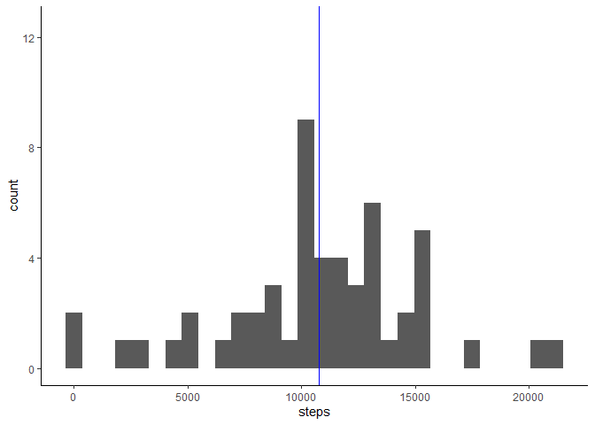
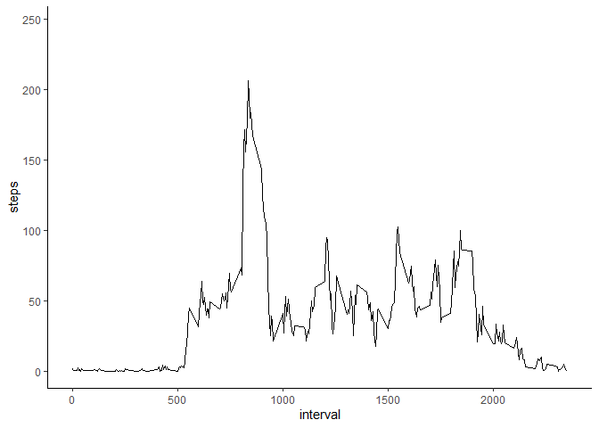
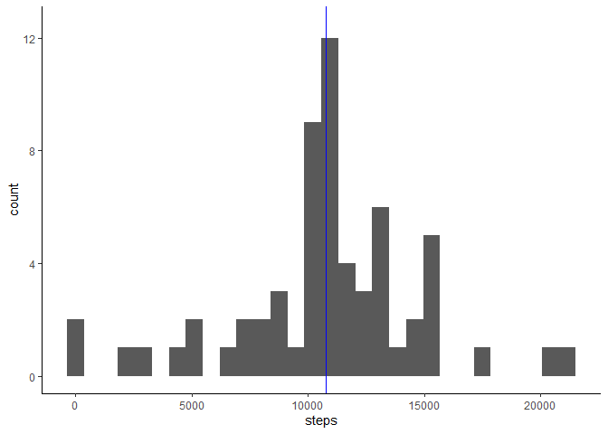
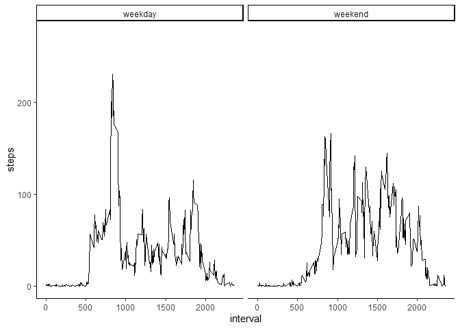

In this analysis, I load the tidiverse just for using the ggplot2 package, which could be loaded alone. 

```r
library(tidyverse)
```

```
## -- Attaching packages -------------------------------------------- tidyverse 1.3.0 --
```

```
## v ggplot2 3.2.1     v purrr   0.3.3
## v tibble  2.1.3     v dplyr   0.8.3
## v tidyr   1.0.0     v stringr 1.4.0
## v readr   1.3.1     v forcats 0.4.0
```

```
## -- Conflicts ----------------------------------------------- tidyverse_conflicts() --
## x dplyr::filter() masks stats::filter()
## x dplyr::lag()    masks stats::lag()
```


## Loading the data

```r
Data <- read.csv("Data/activity.csv")
View(Data)
```


## Setting date as class "Date"

```r
Data$date <- as.Date(Data$date)
class(Data$date)
```

```
## [1] "Date"
```


## What is the mean number of steps taken per day?

###   1. Calculating the total number of steps taken per day   

I separate the data per date and sum all steps in each day. Then I make a dataframe with these values and use it to construct a histogram. 

```r
       Step <- sapply(split(Data$steps, Data$date), sum)
       Steps <- data.frame(steps = unname(Step), 
                            date = names(Step))
```

       
###   2. Histogram of the total number of steps taken each day  

The blue vertical line represents mean calculated below.

```r
       ggplot(Steps, mapping = aes(x = steps)) + 
               geom_histogram() +
               geom_vline(xintercept = 10766.19, color = "blue") +
               expand_limits(y = 12.5) +
               theme_classic() 
```

```
## `stat_bin()` using `bins = 30`. Pick better value with `binwidth`.
```

```
## Warning: Removed 8 rows containing non-finite values (stat_bin).
```

<!-- -->
               
       
       
###   3. Mean and Median  
####      1. Mean number of steps taken per day  

```r
          mean(Steps$steps, na.rm = TRUE)
```

```
## [1] 10766.19
```

####      2. Median of the number of steps taken per day  

```r
          median(Steps$steps, na.rm = TRUE)
```

```
## [1] 10765
```

          
          
## What is the average daily activity pattern?
          
###   1. Time series of the 5-minute interval and the average number of steps taken for all days  

stat_summary calculates the average steps for a particular interval considering all days in the data set. 

```r
       ggplot(Data, aes(x = interval, y = steps)) + 
         stat_summary(fun.data = "mean_se", geom = "line") +
               theme_classic()
```

```
## Warning: Removed 2304 rows containing non-finite values (stat_summary).
```

<!-- -->
       
###   2. Interval that contains the mean maximum number of steps for all days  

I separate the data by interval and calculate the mean for the steps of each interval. Then, I create a data frame with the values and select the interval associated with the highest number of steps.

```r
       Int <- sapply(split(Data$steps, Data$interval), mean, na.rm = TRUE)
       Ints <- data.frame(interval = names(Int), 
                          steps = round(unname(Int)))
       Ints[Ints$steps == max(Ints$steps), 1]
```

```
## [1] 835
## 288 Levels: 0 10 100 1000 1005 1010 1015 1020 1025 1030 1035 1040 1045 ... 955
```

       
## Imputing Missing Values
       
###   1. Total number of missing values in the data set  

```r
       sum(is.na(Data$steps))   # Only the first column has NAs
```

```
## [1] 2304
```
       
###   2. Finding strategy to fill NAs  

First I want to see how NAs are distributed in the data set

```r
       nas <- Data[is.na(Data$steps),]
       table(nas$date)          # 8 days have all NAs
```

```
## 
## 2012-10-01 2012-10-08 2012-11-01 2012-11-04 2012-11-09 2012-11-10 2012-11-14 
##        288        288        288        288        288        288        288 
## 2012-11-30 
##        288
```
It seems that there are 8 days that are completely empty 


###   3. New data set with replaced values from time series  

I duplicate the original data set. Then, I select the rows containing NAs and replace them with the avarage steps for that interval (considering all days). These valuse are the same than those seen in the time series plot. This replacement is done for each day, so I repeated the sequence 8 times.

```r
       Data2 <- Data
       Data2[is.na(Data2$steps),]$steps  <- rep(Ints$steps, 8)
```
       
###   4. Histogram  

I remake the histogram of steps per day using the data set with filled NAs. As before, I separate the data per date and sum all steps in each day. Then I make a dataframe with these values and use it to construct the histogram. The blue vertical line represents the recalculated mean.

```r
       Step2 <- sapply(split(Data2$steps, Data2$date), sum)
       Steps2 <- data.frame(steps = unname(Step2), 
                           date = names(Step2))
       ggplot(Steps2, mapping = aes(x = steps)) + 
               geom_histogram() +
               geom_vline(xintercept = 10765.64, color = "blue") +
               theme_classic() +
               expand_limits(y = 12.5)
```

```
## `stat_bin()` using `bins = 30`. Pick better value with `binwidth`.
```

<!-- -->

```r
       mean(Steps2$steps)
```

```
## [1] 10765.64
```

```r
       median(Steps2$steps)
```

```
## [1] 10762
```

## Are there differences in activity patterns between 
## weekdays and weekends?
       
###   1. Creting new factor  

In this part I used the data set with filled NAs.

First, I transform all the dates into days of the week. My system is in spanish, so I use spanish names for the weekdays. Then, I make a lookup table to subset each weekday to a given category (weekday or weekend). The result is used to create a new column as a factor named "day".

```r
       Days <- weekdays(Data2$date)
       look <- c(lunes = "weekday", martes = "weekday", 
                 miércoles = "weekday", jueves = "weekday", 
                 viernes = "weekday", sábado = "weekend",
                 domingo = "weekend")
       Data2$day <- unname(look[Days])    
```

###   2. Weekdays vs Weekends  

The new factor is used to separate the time series in two panels. In this way, one can observe the activity pattern separated by weekday or weekend.

```r
       ggplot(Data2, aes(x = interval, y = steps)) +
               stat_summary(fun.data = "mean_se", geom = "line") +
               facet_grid(~day) +
               theme_classic()
```

<!-- -->
       
